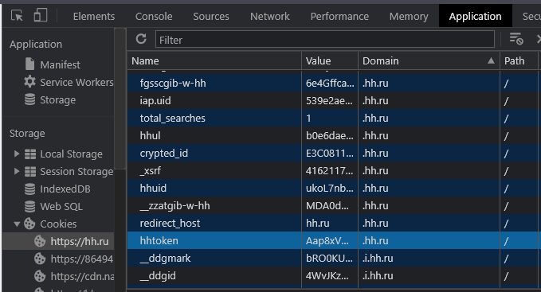

# HH_UPDATER
## `Бот для автоподнятия резюме на hh.ru`

### Особенности

- `для настройки требет только ссылку на резюме и hhtoken из cookie`
- `за Вас тыкает на кнопку "поднять резюме" раз в 4 часа`
- `не ворует Ваши печеньки и не делает ни чего лишнего`
- `готов к работе в docker`
- `не палится`

### Установка

необходимо установить 2 переменные окружения *(например в Dockerfile)*:

| Переменная | Значение |
| ------ | ------ |
| RESUME_LINK |  ссылка на резюме |
| HHTOKEN |  значение hhtoken из cookie |

найти значение `hhtoken` можно на странице `hh.ru` в `Chrome DevTools` во вкладке `Application` раздел `Cookies` - `https://hh.ru`

## License

MIT

:octocat: **Free Software, Hell Yeah!**
